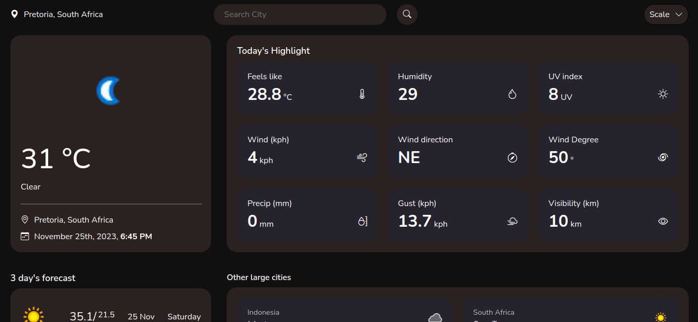

# Weather App

This is a weather app that shows you the temperature of your city in Celsius or Fahrenheit (whatever you prefer). It shows you the day's highlights and forecast for the next three days. 

Click [here](https://lindelwa122.github.io/odin-weather-app) for the live preview.

## The purpose of the project

The goal of this project was to create a compact weather app, honing my skills with **APIs**. Going beyond the basic requirements, I utilized the dom wizard to build the application, giving me a chance to reinforce **OOP design principles**. A key observation during the development was the need for additional functionalities in [**dom wizard**](https://github.com/lindelwa122/dom-wizard) to facilitate automatic page updates when there are changes in store properties. This realization stemmed from the acknowledgment that manually updating the UI when data changes can be a tedious task.

## Credits

- This [project](https://www.theodinproject.com/lessons/node-path-javascript-weather-app) was part of [The Odin Project](https://www.theodinproject.com)'s exercises.
- The API is provided by [Weather API](https://weatherapi.com/).
